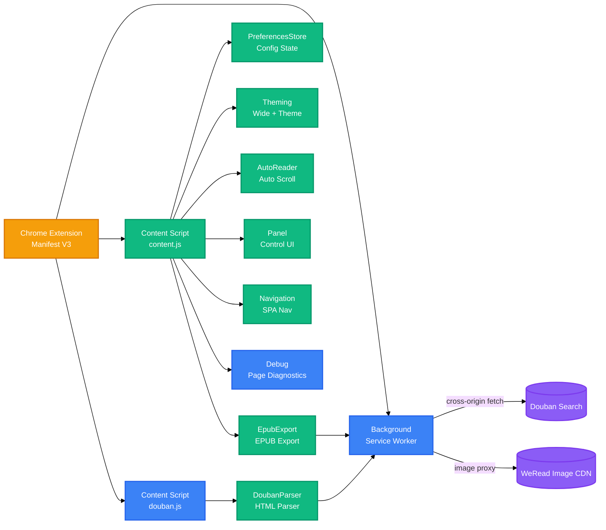

<h1 align="center">WeRead Plus</h1>
<p align="center">
  <strong>Chrome Extension (Manifest V3) — injects wide-screen, theming, immersive reading, and auto-reader into weread.qq.com</strong>
  <br />
  <em>Wide display · Custom themes · Auto-scroll · EPUB export · Douban search · Persistent config</em>
</p>

<p align="center">
  <a href="#quick-start"></a>
</p>

<p align="center">
  
  
  
</p>

<p align="center">
  <a href="README.md">English</a> · <span>中文</span>
</p>

---

## Features

| Feature | Description |
|---|---|
| **Wide Display** | Expands content to full width via CSS stylesheet + inline styles + MutationObserver — three layers that counter WeRead's own style overrides |
| **Theme Colors** | 16 presets (8 light + 8 dark, including "System Default" that follows WeRead's native look); light and dark modes each remember the last-used theme |
| **Immersive Reading** | Hides top bar / bottom bar / controls; reveals on hover; scrollbar hidden |
| **Auto Reader** | Scrolls by step, auto-turns page at bottom; spacebar toggles start/pause; supports auto-stop timer |
| **Douban Integration** | Press Enter in WeRead homepage search box to show Douban results in a side panel (background Service Worker proxies cross-origin requests) |
| **EPUB Export** | Export the current book as EPUB (TOC + images): same-origin WeRead chapter API calls, throttled chapter-by-chapter fetching, per-image failures degrade to placeholders; epub-type books only |
| **Persistent Config** | All settings saved via `chrome.storage.local`, restored automatically after SPA navigation |

## Quick Start

### Prerequisites

- Chrome 110+ (supports Manifest V3 and ES Module dynamic import)

### Install

1. Clone the repository:

```bash
git clone https://github.com/EwenYoung/weread-plus.git
cd weread-plus
```

2. Open Chrome and navigate to `chrome://extensions/`

3. Enable "Developer mode" in the top-right corner

4. Click "Load unpacked" and select the `chrome-extension/` directory

5. Visit `https://weread.qq.com/web/reader/` and open any book

### Run Tests

```bash
npm test
```

## Usage

### Control Panel

After the extension loads, a thin trigger strip appears on the right edge of the page. Hover to slide out the control panel.

### Wide Display

Click the "Wide" button in the control panel to toggle between default and wide modes. The page refreshes automatically to apply the new width.

### Theme Colors

Use the `‹` `›` arrows in the theme color row to cycle through presets. Light and dark modes are independent: when the system switches between them, the theme last used in that mode is restored (the mode's default applies on first entry), persisting across sessions. Choosing "System Default" removes all plugin color overrides and fully follows WeRead's native appearance.

### Auto Reader

With "Auto Mode" turned off, the control panel reveals three sub-controls: scroll step, scroll interval, and auto-stop. Click "Start Reading" or press Space to begin auto-scrolling.

### Douban Search

On the WeRead homepage (`weread.qq.com`), type a keyword in the search box and press Enter. A Douban search results panel slides out on the right; click an item to open the Douban page.

### EPUB Export

Click "Export Book" in the control panel to export the current book as an EPUB file (with TOC and images). Click again while exporting to cancel; large books take a few minutes (images are downloaded with throttling). Only epub-type books are supported; TXT-type web novels are explicitly rejected. The output is for personal backup only.

## Architecture



## Configuration

All settings are persisted via `chrome.storage.local` and survive SPA navigation, dark/light mode switches, and extension reloads.

| Key | Description | Default | Options |
|---|---|---|---|
| `widthIdx` | Page width mode | `0` (default) | `0` default / `1` wide |
| `lightBgIdx` | Light-mode theme index | `0` (System Default) | `0`–`7`, 8 presets |
| `darkBgIdx` | Dark-mode theme index | `8` (System Default) | `8`–`15`, 8 presets |
| `autoMode` | Auto mode toggle | `0` (off, auto-reader available) | `0` off / `1` on |
| `scrollStep` | Auto-scroll step (px) | `2` | `1, 2, 3, 5, 8` |
| `scrollInterval` | Auto-scroll interval (ms) | `30` | `20, 30, 50, 80, 100` |
| `autoStopMinutes` | Auto-stop timer (min) | `0` (disabled) | `0, 10, 30, 60, 120` |

## Project Structure

```
weread-plus/
├── chrome-extension/              # Chrome extension directory
│   ├── manifest.json              # MV3 config (matches, permissions, icons)
│   ├── content.js                 # Reader page entry (thin entry, dynamic import)
│   ├── douban.js                  # Homepage Douban integration entry
│   ├── background.js              # Service Worker (proxies Douban/WeRead image cross-origin)
│   ├── icons/                     # Extension icons (16/48/128)
│   └── lib/
│       ├── preferences.js         # Config state: storage + subscribe + preset cycling
│       ├── theming.js             # Style application: wide//theme/immersive (pure fns)
│       ├── auto-reader.js         # Auto reader: scroll/page-turn/spacebar
│       ├── panel.js               # Control panel UI build + interaction
│       ├── navigation.js          # SPA nav listener + dark/light switch + refresh flow
│       ├── debug.js               # Page DOM diagnostics (window.__wrDiag)
│       ├── douban-parser.js       # Douban search HTML parser (pure logic)
│       └── epub-export.js          # EPUB export: protocol pure fns + packing + factory
├── tests/                         # Zero-dependency tests (node:test)
│   ├── preferences.test.js        # Config state: 28 test cases
│   ├── theming.test.js            # CSS generation: 7 test cases
│   ├── douban-parser.test.js      # Douban parser: 11 test cases
│   └── epub-export.test.js        # Export pipeline: 32 test cases (golden vectors)
├── docs/                          # Project documentation
│   └── agents/                    # Agent collaboration specs
├── .scratch/                      # Feature specs & issues
├── .retro/                        # Session experience base (log/entries/INDEX)
├── package.json                   # Project config (type: module)
└── CLAUDE.md                      # Claude Code collaboration notes
```

## Tech Stack

### Browser Extension

| Technology | Purpose |
|---|---|
| Chrome Extension Manifest V3 | Extension architecture |
| chrome.storage.local | Persistent configuration |
| Content Script | Inject into WeRead pages |
| Service Worker | Proxy cross-origin requests |

### Core Language & APIs

| Technology | Purpose |
|---|---|
| JavaScript (ES Module) | All logic |
| DOM API / MutationObserver | Style monitoring and counter-application |
| matchMedia | System dark/light mode detection |

### Testing

| Technology | Purpose |
|---|---|
| node:test | Zero-dependency unit tests |
| assert/strict | Assertion library |

## Contributing

1. Fork the repository
2. Create a feature branch (`git checkout -b feature/your-feature`)
3. Commit your changes (`git commit -m 'feat: add your feature'`)
4. Push the branch (`git push origin feature/your-feature`)
5. Open a Pull Request

Test cases live in `tests/`. After modifying a module, run `npm test` to confirm existing tests still pass.

## License

[MIT](LICENSE)
