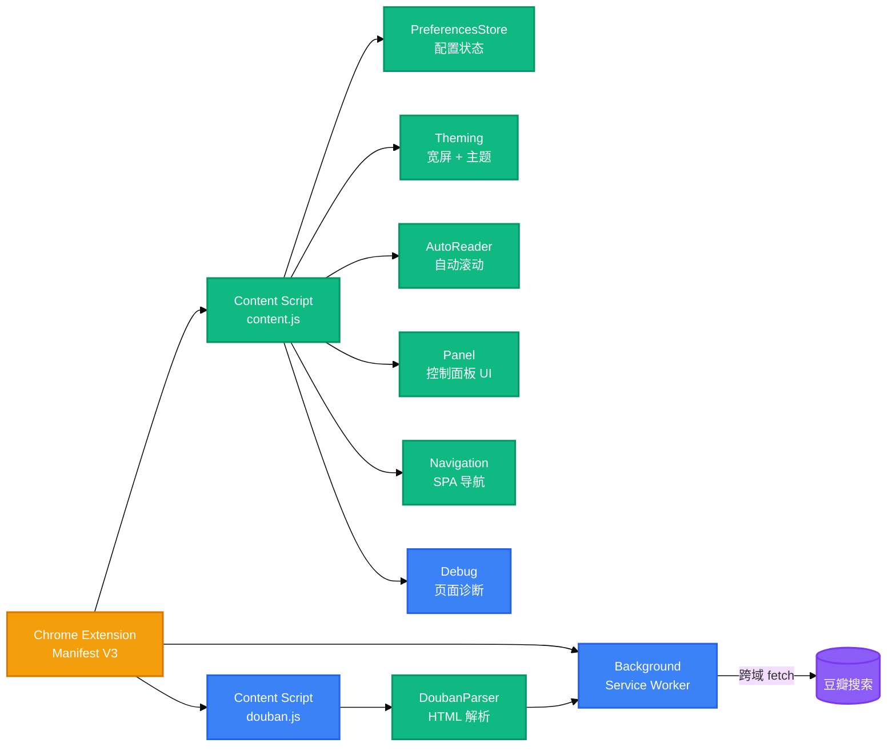

<h1 align="center">微信读书 · 悦读助手</h1>
<p align="center">
  <strong>Chrome 扩展（Manifest V3），为微信读书阅读器注入宽屏、主题、沉浸式阅读与自动阅读能力</strong>
  <br />
  <em>宽屏显示 · 自定义背景色 · 自动阅读 · 豆瓣联动 · 配置持久化</em>
</p>

<p align="center">
  <a href="#快速开始"></a>
</p>

<p align="center">
  
  
  
</p>

<p align="center">
  <a href="README-en.md">English</a> · <span>中文</span>
</p>

---

## 功能特性

| 功能 | 描述 |
|---|---|
| **宽屏显示** | 将正文区域扩展至全宽，通过 CSS 样式表 + 内联样式 + MutationObserver 三层对抗微信读书自带的样式覆盖 |
| **主题颜色** | 11 种预设背景色（暖白、米杏、暗夜黑等），根据系统深浅色模式自动切换可用主题 |
| **沉浸式阅读** | 隐藏顶栏/底栏/控制栏，鼠标悬停时显现，滚动条隐藏 |
| **自动阅读** | 按步长自动滚动，到底自动翻页；空格键控制开始/暂停；支持自动停止计时器 |
| **豆瓣联动** | 在微信读书首页搜索框回车，侧栏展示豆瓣搜索结果（背景 Service Worker 代理跨域请求） |
| **配置持久化** | 通过 `chrome.storage.local` 保存所有设置，SPA 导航后自动恢复 |

## 快速开始

### 前置条件

- Chrome 110+（支持 Manifest V3 与 ES Module dynamic import）

### 安装

1. 克隆仓库：

```bash
git clone https://github.com/EwenYoung/weread-plus.git
cd weread-plus
```

2. 打开 Chrome，进入 `chrome://extensions/`

3. 开启右上角「开发者模式」

4. 点击「加载已解压的扩展程序」，选择 `chrome-extension/` 目录

5. 访问 `https://weread.qq.com/web/reader/` 打开任意书籍

### 运行测试

```bash
npm test
```

## 使用方法

### 控制面板

扩展加载后，页面右侧边缘会出现一条窄触发条。鼠标悬停即可滑出控制面板。

### 宽屏切换

在控制面板中点击「宽屏」按钮切换默认/宽屏模式。切换后页面自动刷新以应用新宽度。

### 主题颜色

点击主题颜色行的 `‹` `›` 箭头在预设间循环切换。系统深浅色切换时，主题自动回退到当前模式的第一个可用色。

### 自动阅读

关闭「自动模式」后，控制面板展开滚动步长、滚动间隔、自动停止三个子项。点击「开始阅读」或按空格键启动自动滚动。

### 豆瓣搜索

在微信读书首页（`weread.qq.com`）的搜索框输入关键词并回车，右侧滑出豆瓣搜索结果面板，点击条目跳转豆瓣页面。

## 架构



## 配置项

所有配置通过 `chrome.storage.local` 持久化，在 SPA 导航、深浅色切换、扩展重载后保持。

| 键 | 说明 | 默认值 | 可选值 |
|---|---|---|---|
| `widthIdx` | 页面宽度模式 | `0`（默认） | `0` 默认 / `1` 宽屏 |
| `bgIdx` | 主题颜色索引 | `0`（Claude 暖白） | `0`–`10`，共 11 种 |
| `autoMode` | 自动模式开关 | `0`（关闭，即自动阅读可用） | `0` 关闭 / `1` 开启 |
| `scrollStep` | 自动滚动步长（像素） | `2` | `1, 2, 3, 5, 8` |
| `scrollInterval` | 自动滚动间隔（毫秒） | `30` | `20, 30, 50, 80, 100` |
| `autoStopMinutes` | 自动停止时间（分钟） | `0`（不停止） | `0, 10, 30, 60, 120` |

## 项目结构

```
weread-plus/
├── chrome-extension/              # Chrome 扩展目录
│   ├── manifest.json              # MV3 配置（匹配规则、权限、图标）
│   ├── content.js                 # 阅读器页面入口（薄入口，动态加载模块）
│   ├── douban.js                  # 首页豆瓣联动入口
│   ├── background.js              # Service Worker（代理豆瓣跨域请求）
│   ├── icons/                     # 扩展图标（16/48/128）
│   └── lib/
│       ├── preferences.js         # 配置状态层：存储 + 订阅 + 预设循环
│       ├── theming.js             # 样式应用：宽屏/主题/沉浸式（纯函数可测试）
│       ├── auto-reader.js         # 自动阅读：滚动/翻页/空格控制
│       ├── panel.js               # 控制面板 UI 构建与交互
│       ├── navigation.js          # SPA 导航监听 + 深浅色切换 + 刷新流
│       ├── debug.js               # 页面 DOM 诊断工具（window.__wrDiag）
│       └── douban-parser.js       # 豆瓣搜索结果 HTML 解析（纯逻辑）
├── tests/                         # 零依赖测试（node:test）
│   ├── preferences.test.js        # 配置状态层 17 个用例
│   ├── theming.test.js            # CSS 生成 7 个用例
│   └── douban-parser.test.js      # 豆瓣解析 10 个用例
├── docs/                          # 项目文档
│   └── agents/                    # Agent 协作规范
├── scratch/                       # 架构重构 spec 与 issues
├── package.json                   # 项目配置（type: module）
└── CLAUDE.md                      # Claude Code 协作说明
```

## 技术栈

### 浏览器扩展

| 技术 | 用途 |
|---|---|
| Chrome Extension Manifest V3 | 扩展架构 |
| chrome.storage.local | 配置持久化 |
| Content Script | 注入微信读书页面 |
| Service Worker | 代理跨域请求 |

### 核心语言与 API

| 技术 | 用途 |
|---|---|
| JavaScript (ES Module) | 全部逻辑 |
| DOM API / MutationObserver | 样式监听与反击 |
| matchMedia | 系统深浅色检测 |

### 测试

| 技术 | 用途 |
|---|---|
| node:test | 零依赖单元测试 |
| assert/strict | 断言库 |

## 贡献

1. Fork 仓库
2. 创建功能分支（`git checkout -b feature/your-feature`）
3. 提交变更（`git commit -m 'feat: add your feature'`）
4. 推送分支（`git push origin feature/your-feature`）
5. 开启 Pull Request

测试用例位于 `tests/` 目录，修改对应模块后请运行 `npm test` 确认既有用例通过。

## 许可证

[MIT](LICENSE)
